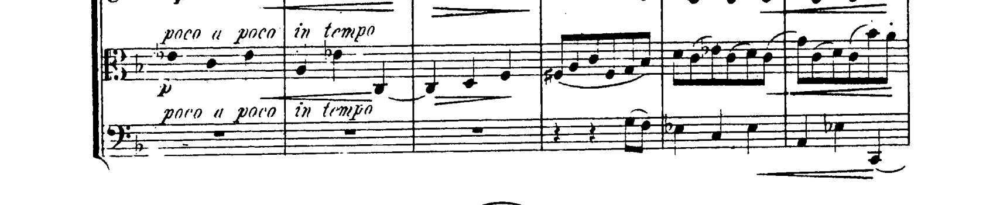
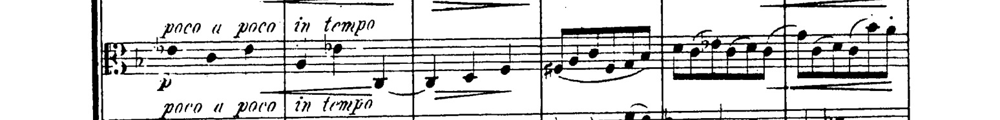
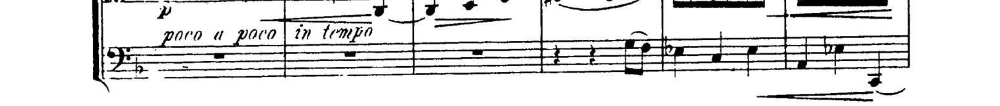

# Continuous staff tracing and ledger-alias protection

The promoted change removes two complete neighboring staves from Brahms Op. 67 p24 system 1 without reducing either instrument's source-defined notation envelope. The exact saved-deskew score still has **nine** whole-neighbor occurrences. This is a bounded improvement, not a declaration that the quartet or the entire corpus is musically ready.

A curved five-line staff can move beyond a local search window near a barline. The analyzer now traces the five lines continuously from the page interior before accepting a larger displacement. It also requires tracing when the proposed local displacement plus two pixels of raster matching uncertainty reaches a full staff-space: otherwise a ledger-line pattern can impersonate the neighboring line of the staff. This replaces the provisional fixed 0.65-space threshold. Source pixels are never erased or rewritten; structural separation is used only for crop ownership analysis.

## Verified crop changes

Coordinates are full-width, top-down corrected PDF points, on physical page 24 (which has no saved rectification).

| Band | Previous top–bottom | New top–bottom | Independent target guard |
|---|---:|---:|---:|
| Viola, system 1 | 94.8002–164.4663 | 94.8002–145.7293 | 100.1856–137.1856, complete |
| Violoncello, system 1 | 96.4605–170.6329 | 125.3961–170.6329 | 135.1856–170.1856, complete |

Both source guards were frozen by the root reviewer before evaluating candidate edges; `p24-source-guards.json` is unchanged. Source and actual strip images are included alongside this report. The viola retains its printed direction, all notes, beams, ledger lines, slurs and hairpins; the cello retains its printed direction, rests, notes, low ledger-line note, slur and hairpin. Partial neighboring ink remains.

## Scope and evidence

- `bash tools/test_crop_quality.sh`: **503 checks**, including all prior controls, larger page bends, ledger aliases, real cross-staff figures, continuously curved true barlines, and 336 cases requiring both planned crops to contain the full independently constructed musical envelope. No original ±7-pixel guards were relaxed.
- The independent [curved-harmonic audit](../residual11-curved-harmonic-audit/README.md) instrumented **588 cases**, recording actual cuts, source-mask loss, stem gaps, endpoint ownership and final crop containment. At raster scales 0.5–1.5, all 672 crops preserve the entire envelope; two production-baseline severances are repaired. The extra 252 very-low-resolution cases expose 103 pre-existing envelope misses, unchanged by this change. These remain open limitations.
- All **36 PDFs / 1477 physical pages** were reanalyzed using immutable source and profile hashes. Staff/raster geometry, assignment identities and band counts are unchanged. Analysis components change on 13 pages, but only the two p24 crops change. See `corpus-comparison.json`. No complete all-score musical review or all-score fresh export is implied by those geometry results.
- Brahms uses the immutable original source SHA256 `662aabfdecb2d125151c984fe1dc866ea068668ee9bb74f23f286f552603c14a` and the exact nine saved corrections on pages 2, 7, 17, 19, 23, 28, 34, 38, 39; no corrections were re-estimated. All 604 cue-free vertical crop bounds match the previously source-reviewed tracing candidate. Across 60 frozen guard regions, there are no new or worse losses; existing losses remain explicitly recorded in `alias-exact-source-comparison.json`.
- The old diagnostic profile used a 10 pt right margin, while the complete export uses zero side trim. Comparison to actual exported source rectangles checks this explicitly. One existing Da Capo expansion in p28 s2 cello is absent from both cue-free diagnostic plans and is retained separately when direction metadata is merged; it must not be replaced with the shorter cue-free edge.

One Mendelssohn source had small raster/staff-fit differences versus the older saved run. A freshly compiled, unchanged baseline through the same harness reproduced those differences exactly; the candidate comparison uses that baseline for the ten affected pages. This avoids attributing rendering-run differences to the algorithm.

## Review corrections and remaining work

The initial expanded curved test wrongly required a preserved musical component to start right of half-page. Harmless staff remnants made its bounding box wider, so that test reported 104 apparent failures. Independent pixel/crop review showed only two actual severances. The final tests check source-defined musical envelopes in both crops; component width and detached analysis endpoints are recorded separately. These controls were corrected to measure preservation, not exempted from it.

The 0.35-space provisional guard widened two already-good p33 violin crops and was rejected. The 0.65-space provisional guard passed the tested grid but was superseded by the raster-uncertainty condition. Neither percentage cutoff is in production.

The existing original-tracing PDFs still have 64 pages (17/16/16/15). Fresh rendering against the current connector8 folder finds 45 identical pages, rather than the historical 48: the three additional differences are first-page title text. `full-output-reverification.json` records current hashes and each changed page; it does not claim those PDFs were freshly exported from the final candidate. A separate delivery task combines the final inventory with the complete heading/navigation/ending metadata and re-exports all four parts.

Nine complete neighboring-staff occurrences, partial neighboring ink, the documented very-low-resolution envelope misses, and remaining full-score musical/pagination review still require work. The full extraction goal remains active.
