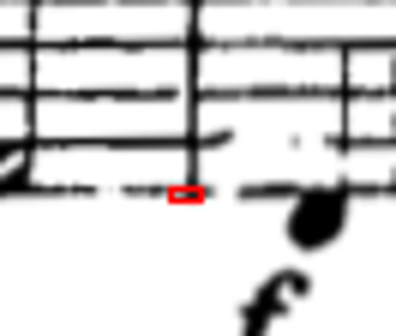
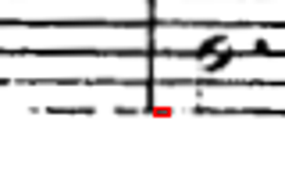
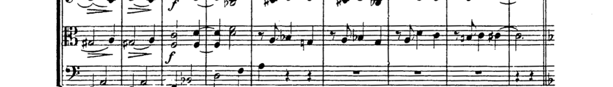

# Endpoint ownership experiment — rejected

The remaining nine whole-neighbor crops in Brahms 93521 are still unresolved. A bounded endpoint-notehead experiment preserved every tested synthetic musical envelope but worsened real crop readability. Both versions are rejected; after the second structural regression, the experiment stopped. Production code and delivered parts were not changed.

## Source facts frozen before testing

The ten target envelopes in `source-guards.json` were copied byte-for-byte from the prior near-edge musical-stem report before building a candidate. They cover the nine offending crops plus the adjacent p31s1 Violin I reference. Their SHA-256 remains `e097a2b80032e18b85606f4f02c13e24870162857a02bf95f6b58786f2cdbe0c`. No edge or tolerance was changed.

The original 39-page source is SHA-256 `662aabfdecb2d125151c984fe1dc866ea068668ee9bb74f23f286f552603c14a`. Both fresh native runs use the exact nine saved corrections on physical pages 2, 7, 17, 19, 23, 28, 34, 38 and 39. The frozen source-review PDF is separately bound in `frozen-inputs.json`. All 604 fresh baseline vertical crops match the authoritative prior cue-free plan within 1e-10 normalized-coordinate precision; see `baseline-binding-comparison.json`. No direction metadata is merged or replaced in this experiment. In particular, the delivered p28s2 Cello Da Capo expansion is untouched.

Source-first views show that the nine occurrences come from five paired regions:

| Physical source region | Existing whole-neighbor crop(s) | Source observation |
| --- | --- | --- |
| p24s2 | Viola and Cello | Right system barline has an interior break in the lower staff; both staff endpoints and horizontal line ends remain visible. |
| p28s1 | Violin I and II | Right system barline is clear; one lower horizontal line is interrupted near the probe. |
| p29s1 | Violin I and II | Right repeat barline; lines bend below the page-center prediction. |
| p31s1 | Violin II | Right barline persists where two upper horizontal staff lines are locally missing. |
| p35s1 | Violin I and II | Right barline joins two bowed staves; local lines are displaced from the global fit. |

The intended notes belong to separate parts in these source regions; none is a genuine musical stem crossing between the paired instruments. The existing widened crop is driven by structural connectivity.

## Bounded candidates and results

The experiment leaves the production 88% core-support gate, continuous tracing/alias guard and existing local-junction fallback unchanged. It adds only a veto intended to preserve a compact head attached near an actual vertical stroke endpoint. Continuation beyond the outer staff boundary is intended to distinguish an interior tie touching a through-going barline from a terminal notehead. No output pixels are erased or rewritten.

V1 measured continuation in a narrow band around the connector’s gap-column position and looked for a compact solid attached patch. It wrongly allowed a long horizontal staff line to certify that patch. V2 adds the missing bounded-run check and a wider continuation probe; it is a measurement correction, not a new crop margin.

| Evidence | Fresh production baseline | V1 | V2 |
| --- | ---: | ---: | ---: |
| Existing crop checks | prior 755 pass | 755 pass | 755 pass |
| Expanded 336 independent musical envelopes preserved | 0 / 336 | 336 / 336 | 336 / 336 |
| Additional 48 near-edge cases preserved | prior 0 / 48 | 48 / 48 | Included in broader grid; separate harness not rerun |
| Additional 12 broken-barline controls separated | prior 12 / 12 | 12 / 12 | Separate harness not rerun after rejection |
| Brahms whole-neighbor occurrences | 9 | 487 | 27 |
| Changed Brahms crops | — | 480 | 18 |
| Original nine crops repaired | — | 0 | 0 |
| Frozen local source envelopes contained | 10 / 10 | 10 / 10 | 10 / 10 |

V2 leaves all original nine crops exactly unchanged and adds eighteen whole-neighbor occurrences elsewhere. All staff/raster geometry, assignments and the 604 band identities match the baseline. Several changed edges also become smaller; containment of the ten original guards is not a preservation certification for all newly changed crops. The candidate already fails the readability criterion, so no wider corpus run or candidate PDF delivery was warranted.

`endpoint-head-v2-comparison.json` lists all eighteen changed crops. `endpoint-head-comparison.json` preserves the much larger V1 failure. The old tests and the expanded source-pixel oracles were used unchanged. The fresh expanded-grid baseline result is new evidence: all 336 fail, rather than inferring that baseline result from the older narrower 48-case run.

## What defeated the corrected endpoint test

A logging-only copy of V2 inspected native rasters on eight source pages. On corrected p28 it identifies “heads” at raster boxes x278–283/y721–723 and x503–507/y1450–1452. Source enlargement shows **broken outer staff-line fragments at a true barline junction**, not noteheads. Their small isolated horizontal runs pass the compact-patch condition at this raster scale. These are different from simply treating a whole unbroken horizontal line as a head.

This causes the p28s2 Viola crop to include the complete Cello staff. At p17s1 the Violin I crop similarly gains the complete Violin II staff. Both full source contexts were examined before viewing their before/after strips. The report contains those source images and strips. This is a concrete structural regression, despite passing all synthetic notehead preservation examples.

No further patch-size, junction-tolerance or core-support tuning was attempted after this second real-score failure.

## Per-line endpoint evidence and a different next mechanism

`per-line-endpoint-probe.json` records a source-local horizontal-ink measurement on all five original residual regions, with native raster dimensions, columns, each predicted row, each selected local peak and support on either side of the barline. The overlays use blue for the global row prediction and orange for a local peak; they are diagnostic measurements, not a certified tracker.

- On p24, all ten horizontal line peaks have full support to the left and none to the right; the scan break is in the vertical stroke between lower staff lines. A blanket occupancy change cannot safely infer its meaning.
- On p28, nine line peaks have full left support, but one lower line reaches only 0.29. A uniform five-line minimum therefore rejects otherwise clear structure.
- On p29 and p35, the local lines lie roughly 0.5–0.9 staff spaces below the global estimates. All line ends are visibly at the common right boundary; trusting a translated five-line pattern without continuous identity can still alias a ledger line.
- On p31, two upper local line probes have zero support. Their orange markers are **predicted positions in a gap**, not discovered ink. This region requires tracing identity from the interior; a local endpoint test alone cannot establish all five lines.
- Every selected line probe has zero support on the right of the system boundary. The source-defined musical-stem fixtures continue their horizontal staves beyond the musical stem, giving a distinct global endpoint relationship. That relationship is promising evidence, but not a sufficient cut rule: a musical stem can also occur at a system edge.

A more suitable next experiment would build a typed connection graph: trace the identities of all five staff lines from interior anchors, establish a shared system boundary across the instrumental group, and label the vertical path connecting those independently established ends as structural. Preserve separately attached musical components instead of making one local “head/no head” decision propagate ownership along the entire barline. A musical terminal at a staff boundary must remain a negative control, along with interrupted horizontal/vertical strokes and compact staff fragments. The existing 755 checks, expanded 336 envelopes, immutable source guards and real-score whole-neighbor count remain required checks. This graph mechanism is proposed only; it was not implemented or validated here.

## Reproduction and review scope

All code is isolated under `.build/residual9-endpoint-ownership-2026-10-03/`. `frozen-inputs.json` and `provenance.json` bind the exact snapshot, controls, binaries, inputs and native runs. The report archives both rejected patches, test results, comparator, native harness, trace and per-line probe. The original source details, all five line-probe overlays, two logged false-head locations, and two representative full-source/before/after crop comparisons were visually inspected. All nine original crop envelopes were checked numerically. No independent second-agent review was available during this bounded subtask; it is not presented as one.

Initial sandbox attempts stopped at the native correction renderer; their incomplete results were excluded. The authoritative Mac-native baseline/V1/V2 runs each completed all 39 pages with exit 0. No Vision OCR was rerun. No complete all-score musical review or candidate PDF export is implied by the numerical crop comparison.
