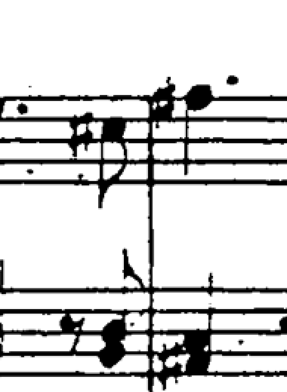

# Musical-stem ownership study — isolated, not promoted

This study starts from `82b606e` and leaves production unchanged. It separates two concrete defects: connector cuts can use the wrong local staff coordinates, and replacing local notation fragments with a merged component can lose their original ownership. The frozen source masks remain authoritative. An improved synthetic pass count is not a full musical-preservation or release claim.

The earlier endpoint-head experiments are retained in [the rejected study](../residual9-endpoint-ownership/README.md). Their 487/27 whole-neighbor outcomes motivated direct source-line provenance and branch tracing here. The unchanged 297-control suite, expanded 336-control suite and ten real-score source guards were frozen before this experiment. `frozen-inputs.json` and `baseline-control-binding.json` bind their source and the baseline implementation. The six compilation inputs for both synthetic suites exactly match the previous V2 baseline, so its 201/297 and 0/336 results are reused with explicit hash evidence.

## Exact failure stage, before experimentation

Logging-only analysis of five full-resolution source masks leaves every result identical to its row in the frozen baseline. It records the thresholded source, analysis staff removal, connector removal, resulting components and crop envelopes. See `diagnostic-stages.json`, `diagnostic-results.json`, and `evidence/`.

| Source case, 720 × 760 pixels | Causal observation |
| --- | --- |
| Clean structural boundary | Staff removal loses seven explicitly owned crossing pixels per instrument in the analysis mask; connector removal loses no additional owned pixels. Every final source envelope is retained. |
| Genuine full-height musical stem | Staff removal loses 47 owned pixels per owner; connector removal loses another 528. Both inter-staff spans are cut as if structural. The target source stem continues to y529; the first two crops end at y241/y391. |
| Genuine stem inset eight pixels from outer lines | Existing gates reject the right-hand connector. No additional owned pixels are erased by connector separation, and all three final target envelopes survive. |
| Head at a barline junction, tilt −1.5°, bow −10 px | The first pair uses a nominal shift −6.3239 while the next pair uses observed local shift −15.3239. Connector removal discards 72 additional owned pixels from the middle staff; its source starts at y292 but the crop starts at y295. |
| Same head at a nominal straight junction | Analysis erasure still discards 45 additional owned pixels from the middle/lower targets, but the output margins hide the loss. Passing crop bounds alone is not proof that analysis preserved the musical connection. |

Only the analysis mask is edited. The original PDF/image pixels are not erased. A lost analysis connection nevertheless matters because it determines which original pixels are included in the exported crop.

## Coordinate-provenance experiment, rejected

`unified-geometry-v1` makes local staff-coordinate resolution and all-five-junction proof mandatory even when the old nominal core test passes. It changes no gate threshold. This repairs all three `headAtJunction` omissions and 21 near-edge controls, but four already-failing target envelopes lose additional retained extent. The full 39-page native Brahms run grows from seven to 129 whole-neighbor occurrences, with 69 changed crops. It is rejected.

A separate logging-only run produces an exactly identical plan and identifies the source of the widening. Among connectors that previously passed the nominal route, 43 fail local geometry, two fail the strict junction test, zero fail translated core occupancy, and 3,046 pass. The 122 new target/neighbor inclusions associate with connecting pairs containing 118 geometry failures and four junction failures. This is a path association, not a counterfactual ablation of every alternative structural path. Details and per-page coordinates are in `unified-geometry-v1-classification-stages.json`.

This demonstrates a coordinate defect but does not justify replacing every existing structural decision with an unavailable local fit. Root's separate staff-path experiments are not incorporated here.

## Source-witness experiments

V1 retains the prior direct terminal attachment and compact-body requirements, but excludes rows whose source ink continues as a horizontal line beyond the complete possible head. The body must connect directly to the measured physical spine; the detector does not jump across white pixels to a nearby stem. This excludes the historical broken-staff-fragment witnesses, and a fresh full Brahms run changes only two crops on physical page26.

V1 preserves 331/336 expanded musical envelopes. All five remaining failures are elliptical heads at inset6: the true head overlaps the next staff line, so requiring every body row to be off-staff rejects real notation. V2 retains the whole compact-body condition and instead requires off-staff evidence within that body. It also traces the complete off-spine branch in the analysis mask rather than accepting only an arbitrary patch inside a larger component. V2 preserves all336. Relative to V1, its combined changes lose three near-edge successes and gain four ledger-alias successes in the297 suite; the complete-branch guard did not reduce the real p26 widening and may be unnecessarily restrictive. Those intermediate results remain in full. V2 does not resolve every tilted/bowed or source-broken case in the broader297 suite.

The p26 witness is **real musical ink belonging locally to Violin I**, part of a sharp touching an interior barline, not another bare staff fragment. The logged native witness is x1241–1246/y182–186 in the 1800×2593 raster. Vetoing the entire connector gives both Violin I and II the full pair of staves. V2's complete-branch check does not remove this ambiguity. This study does not tune a symbol classifier to hide that result. The user prioritizes target notes over neighboring ink, so two disclosed wider crops are a tradeoff; a new target omission is a blocker.

The detail above is a nearest-neighbor enlargement of an exact native-source rectangle `(1140,110)-(1330,370)`. `evidence/p26-poppler-context.png` supplies page context and uses a separate renderer; no pixel measurement is taken from it.

## Broken source gap and non-monotonic ownership

Both V1 and V2 worsen one already-failing297 case: `edgeMusicBroken`, scale0.5, tilt1.5°, bow0. This is not caused by additional pixel erasure. The source stem has an eight-pixel scan break. In the baseline, its detached tail `[600,230,604,242]` is an ownerless component that the planner includes near the upper staff. After preserving the lower connection, that tail merges into `[592,230,610,532]`, with geometric staff owners `[1,2]`. The planner then excludes it from the upper part, whose crop bottom shrinks from248 to243.4269. `broken-*.page.json` records the exact components and source-derived result rows.

This is why simply preserving more connected pixels is insufficient. V3 retains the original local fragments and adds the uncertain musical connection as separate evidence. It deliberately preserves both source interpretations instead of replacing the locally attributed fragment with the new merged box. It uses a second analysis pass as a correctness prototype; this is not an optimized production graph implementation. Full intended ownership across a broken source stroke remains unresolved even when the previously retained tail is kept.

## Frozen outcome

| Check | Baseline | Unified geometry V1 | Source witness V1 | Source witness V2 | Additive evidence V3 |
| --- | ---: | ---: | ---: | ---: | ---: |
| 297 complete source envelopes | 201 | 225 | 237 | 238 | 238 |
| Already-failing envelopes worsened | — | 4 | 1 | 1 | **0** |
| 336 complete musical envelopes | 0 | 214 | 331 | 336 | **336** |
| New previously passing control failures | — | 0 | 0 | 0 | **0** |
| Fresh Brahms whole-neighbor occurrences | 7 | 129 | 9 | 9 | 9 |
| Fresh Brahms changed crops | — | 69 | 2 | 2 | 2 |
| Ten unchanged real-source guards retained | 10 | 10 | 10 | 10 | 10 |
| Existing 755 crop checks | prior pass | not rerun | not rerun | not rerun | **755 pass** |

V3 retains every baseline component on all39 native pages; `primitive-component-preservation.json` verifies this directly. Its new evidence repairs the one additional upper-tail omission without claiming to recover the complete source-broken musical stroke. The59 remaining failures and per-family counts are in `v3-remaining-failures.json`. Every previous test source, source envelope and tolerance is unchanged. Broader runtime and corpus validation, independent review, and an efficient ownership graph are still needed before production use. No candidate from this study has been promoted.

## Scope and reproduction

All candidates are isolated under `.build/stem-ownership-2026-10-03/`; the durable patches in `candidates/` apply to the frozen `82b606e` analyzer. The copied source controls are unchanged. `harnesses/build.sh CORE HARNESS OUTPUT` compiles the six required native sources; `controls297.swift OUTPUT_JSON [FIXTURE_FOLDER]` and `expanded336.swift OUTPUT_JSON` execute the independent source-envelope checks. `harnesses/actual.swift` runs the complete native39 analysis from the bound inventory and profile, using the original source and exact nine saved rectifications. Native macOS rendering access is required. OCR and shared-heading/ending recognition are not rerun; their absence is not treated as a regression.

The native comparator checks all604 band identities, assignments, source/staff/raster geometry, exact crop deltas, whole-neighbor counts and all ten frozen source guards. Large PDFs, native binaries and full native inventories remain in scratch and are bound by hashes. No candidate parts were delivered or packaged from this study. No full36-score corpus test, complete score musical review, or independent second-agent certification is claimed.
