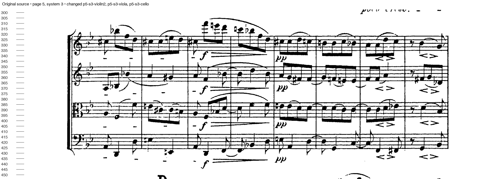
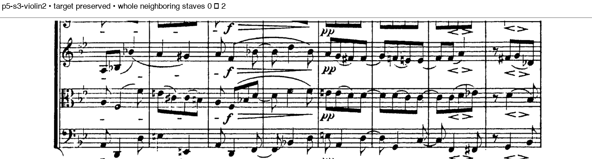
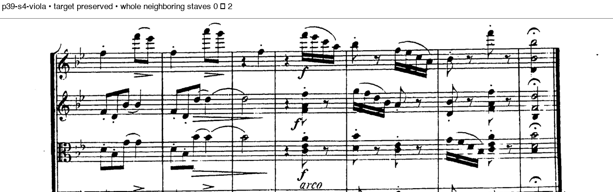
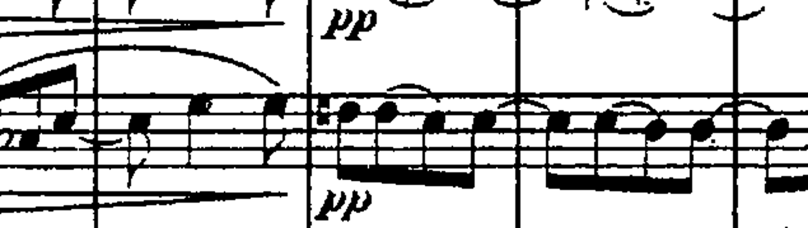

# Terminal-attachment candidate: rejected after source review

The candidate preserves the local target notation reviewed here but makes the parts substantially harder to read. **Do not promote it.** Complete neighboring-staff occurrences increase from **9 to 75** when using the exact saved corrections from the delivered Brahms draft.

The analyzer under review is `NativeScorePageAnalyzer.terminal-attachments.swift`, SHA256 `1ebf3f912e665ae066342336c96660ccf2bb914093a69471a179aa4ac98072bb`. Production was not changed. This candidate combines junction checks on both connector paths with a veto for compact musical attachments near the outer staff ends. Its 755 existing checks and 336 expanded synthetic musical-envelope cases pass; those results did not predict real-score crop quality.

## Source-first preservation review

Nine independent target envelopes were frozen from full-width, original source systems before examining their smaller candidate edges. All nine are contained by the candidate. The complete review then covered **27 source systems and all 56 changed raw candidate strips**, including high/low notes, ledger lines, beams, slurs, articulations, rests, clefs/signatures and local dynamics. All 56 local target envelopes are contained. The guards include small visual margins; none was moved or reduced to pass a check.

The corrected-page run uses the **same nine saved rectifications**, on physical pages 2, 7, 17, 19, 23, 28, 34, 38 and 39. No corrections were estimated anew. Staff and raster geometry are unchanged, and all 604 band identities remain. Three smaller-edge cases on corrected pages were independently reviewed in corrected source coordinates: p17 s1 viola, p23 s3 violin II and p28 s2 violin I. Their complete local target envelopes remain contained as well.

These findings establish preservation for the regions reviewed, not a complete musical-readiness certificate. Shared headings, rehearsal marks, endings and navigation continue to depend on the separately reviewed source-copy metadata. In particular, the existing p28 s2 cello Da Capo owner expansion must be retained when merging inventories. No final part PDFs were substituted with this rejected candidate.

## Neighboring-notation regression

| Comparison | Before | Candidate |
|---|---:|---:|
| Whole-neighbor occurrences within the 56 changed raw bands | 0 | 59 |
| Whole-neighbor occurrences across all raw bands | 10 | 69 |
| Whole-neighbor occurrences with saved corrections | 9 | 75 |
| Changed bands with saved corrections | — | 62 of 604 |

Of the 62 changed corrected-score bands, 27 are on rectified pages. `exact-corrected-comparison.json` lists every changed rectangle and neighboring-staff identity. `raw56-review.json` records the source and strip review for each raw changed band. The smaller edges do not compensate for the much larger opposite-edge expansions.

For example, p5 s3 violin II newly includes both viola and cello. At p39 s4, the viola crop newly includes both violins. These are unrelated full staves, not required cross-staff figures.

## Cause and next action

Real ties/slurs can touch a structural barline inside a staff. The candidate mistakes some of those attachments for evidence that the entire vertical connector must remain musical. That propagates ownership across unrelated instruments. The existing per-row branch preservation can retain the tie while separating the structural connector; a global attachment veto is too broad. Earlier versions additionally mistook curved staff-line remnants for attachments.

The next bounded comparison is the junction-fallback-only candidate, without this attachment veto. It addresses the original shortcut that bypassed junction checks while leaving low-resolution endpoint ambiguity explicitly unresolved. It still needs the existing 755 controls, source-envelope checks, exact saved corrections and a quantified neighboring-staff comparison before any promotion.

All original review renders, per-strip PNGs, ten contact sheets, scripts, immutable-source checks, the frozen Core snapshot and native run logs remain under `.build/qc-algorithm-audit/residual9-source-first/source-review/` and its parent. `provenance.json` binds the durable evidence to the exact candidate and source.
