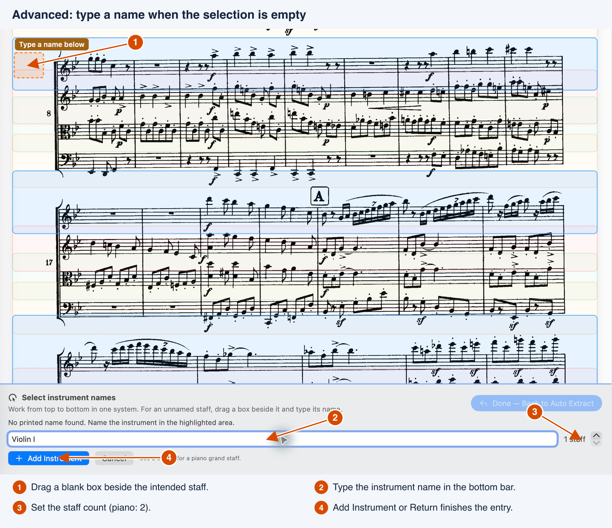
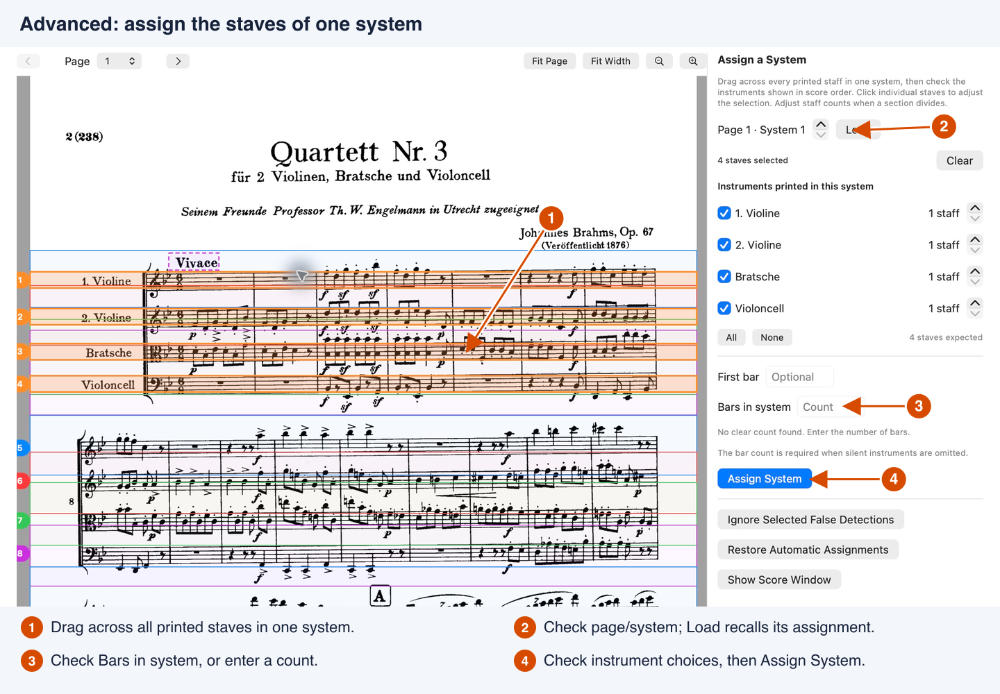
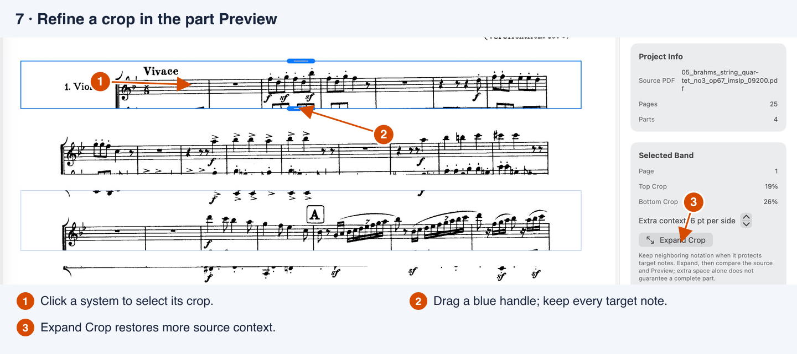

# Advanced Partsmith workflows

Start with the illustrated [Getting Started guide](getting-started.md) for opening a score, running Auto Extract and exporting your first parts. Use the tasks below when a score needs more assistance. These instructions describe the downloadable Alpha 6 app.

Partsmith preserves the source's printed notation. Before using a part in rehearsal or performance, compare its pages with the full score: check the instrument, every measure, notes, lyrics and directions. Clean-looking crops alone do not establish a complete part.

## Add unnamed or repeated instruments

In **Auto Extract**, choose **Select Instrument Names on Score**, or **Add Names from Score** if your list already has entries.

- **A label is incomplete:** drag a box around the whole label, including an instrument number such as `1.` or `II`. Drag its green corner handles to reread a different area. You can also correct the name in the setup list.
- **No name is printed:** drag a box in the blank area beside that staff. When no name is recognized, a name field appears in the bar below the score. Type the instrument's name, choose its staff count and press **Add Instrument** or Return. **Cancel** discards that pending box.
- **Two staves have the same name:** make a separate selection for each instrument. Separate boxes produce separate parts with unique names. Do not select the same label again to create another instrument.

Work from top to bottom within one complete system, then choose **Done — Back to Auto Extract**. Check the resulting order and names. Use **More → Replace List from Score** if you want to rebuild the entire list.

This example shows a pending name in the blank margin of a continuation system. During initial setup, add each instrument once; if you already selected its printed name in an earlier system, you do not need to add it again.

The name boxes identify instrument entries; they do not select the staff crops. Staff counts and assignments are checked separately during Auto. You can also enter the list directly with **Add Instrument** in setup.

## Piano, vocal parts and divided staves

Give a piano grand staff **2 staves** in the instrument list. Those two staves belong to one part and one system. A score with separate violin instruments normally has one entry and **1 staff** for each violin, rather than one two-staff violin part.

Enable **Lyrics** for each vocal part. After extraction, check all verses, syllables, shared lyric lines and footnotes. If lyrics or detached directions need more room, open **Crop Context — Padding and Source Margins** in Auto setup. Increase **Below all parts**, or enable **Custom padding for…** for only the relevant instrument. Padding is measured in staff spaces.

Use **Compact — follow notation** for a starting crop that follows nearby ink. **Fixed padding** uses the chosen distances consistently and can retain more neighboring notation. Either mode needs source comparison where ink overlaps.

For a temporary split or divided section, use the per-system staff counts in **Assign Instruments** described below.

## Scores that hide silent instruments

Use this workflow when different systems contain different instruments. For example, a concerto may switch from a full ensemble to piano alone. Assigning every detected staff by a repeating fixed order can put music in the wrong parts.

1. In Auto setup, include every instrument needed for the score. Enable **Instrument layout changes between systems**, then run **Auto**.
2. Choose **Assign Instruments** in the review, or **Assign Instruments on Enlarged Score**. Move or resize the Auto window and use **Fit Width** or the zoom buttons to see the staff group clearly.
3. Drag across **every printed staff in one complete system**. The staves highlight as you drag. Click individual staves to adjust the selection; Shift-click or Shift-drag adds staves. Use **Clear** to start the selection again.
4. Under **Instruments printed in this system**, check only the instruments actually present, in score order. Set each one's printed staff count. The selected total must agree with **staves expected**.
5. Check **Page N · System N**. System numbers restart on each source page. Enter **First bar** if known; it is optional. Check or enter **Bars in system**, then choose **Assign System**.
6. Repeat for each layout or unresolved system. Returning to an assigned system recalls its instruments, counts and optional first bar. **Load** restores the selected system's saved assignment too.

This screenshot uses the fixed Brahms quartet to demonstrate the assignment controls. For a score with changing instrumentation, select its actual system and check only the instruments printed there.

Partsmith suggests **Bars in system** from clear, shared printed barlines when possible. A piano grand staff counts measures once. A single selected staff, unclear scans or disconnected barlines may require a manual count. Pickups and measures split across systems need musical checking: printed compartments are not always whole bars.

Unchecked instruments receive that many bars of inserted rest. Confirm they are actually silent, and retain any tempo, meter or rehearsal change at its proper measure. A count entered for one system is not a valid substitute for checking another.

### Reuse an assigned layout

After assigning one example of a layout, expand **Reuse Assigned Layouts** and choose **Find Similar Systems**. Use **Show** to inspect each proposal on the score. Select the correct proposals, check their individual bar counts and choose **Use Selected Layouts**.

Two systems with the same number of staves can still contain different instruments. Check identities as well as geometry. Suggestions help with repeated layouts; unresolved systems still need assignment.

## Clean overlapping crops in the part view

1. Add the parts, select an instrument in the sidebar and switch to **Preview**.
2. Click a system. Drag its blue top or bottom handle to trim extra staff fragments. Release to apply; Escape cancels the drag.
3. Compare the changed crop with **Source**, including the ink just outside each edge. Preserve the intended notes, ledger lines, slurs, dynamics, lyrics and directions. Undo restores the previous crop.
4. If something is missing, select the system and use **Expand Crop** in the Inspector. **Extra context** sets how many source points to add on each side; repeat if needed, then check again.

The selected system exposes its crop handles in Preview. Neighboring fragments are visible in this example; check the full score before trimming them.

Preview, Source, the saved project and exported PDF use the same crop. If a strip is compressed as a multi-bar rest, choose **Restore Original Crop** before refining it.

Keep neighboring ink when removing it could remove target notation. A top or bottom crop cannot separate notes that physically overlap. **Whiteout Areas** can hide a spatially separate fragment, but their boundaries are entered numerically. Check that no intended ink crosses the area; **Delete Area** restores the source ink. Crop or page-alignment changes require checking existing whiteouts again.

For horizontal source trims, use **Trim left margin** and **Trim right margin** in Auto setup. Check clefs, instrument labels, signatures, ending barlines and directions before trimming. Direct Preview handles adjust the top and bottom edges.

## Enlarge the music and choose page turns

Select a part in Preview and use **Score Layout** in the Inspector.

| Control | What to expect |
| --- | --- |
| **Scale** | Applies the requested enlargement, including above 1.00×. **Fits Within Margins** is guidance; exceeding it can put notation beyond the paper edge. Inspect the right and left edges in Preview and the exported PDF. |
| **Side Margins** | Changes the output page's available width. New projects start at 18 pt. This is separate from trimming the source image. |
| **System Gap** | Sets the actual space between systems, from 4 to 200 pt. Larger gaps can add pages. |
| **Use Consistent Scale** | Keeps relative source sizes and horizontal alignment within the part. Leave it enabled when neighboring source systems should remain aligned. |
| **Balance Page Fill** | Redistributes complete systems across pages while preserving the selected gap. It does not read the music to choose page turns. |

Sliders update the Preview after you release them. Large PDFs can take time to redraw; wait for **Updating preview…** to finish before judging the result.

**Scale**, **System Gap** and **Side Margins** are shared across parts by default. Enable **Customize This Part** for an exception; turn it off to resume the shared settings. **Use These Settings for All Parts** applies the selected part's layout across the score and clears local overrides. Page balancing and consistent scale remain per-part choices.

For a movement or a better turn, click its first system and enable **Start on New Page** under **Selected Band**. An **Editorial Label** can add a movement title or a clearly transcribed direction above that system. Inspect the page before and after each turn for a usable resting opportunity.

## Printed title and shared directions

Leave **Find the printed title and composer automatically** enabled in Auto setup to suggest a header above the first music system. Check its preview before **Add Parts**. Use **Adjust on Score** to resize the selection, or turn off **Use Printed Header**. If no header is found, choose **Select Header on Score**.

After extraction, the Inspector's **Header → Source Header → Edit** lets you select the printed header manually. Drag the rectangle or its corner handles and choose **Save**. The selection is shared by the parts. Choose **Typed** for an editable title and subtitle instead; **Show Title Block** and **Show Part Name In Header** control their visibility.

**Copy detected tempos, repeats and paired endings (experimental)** can help with shared directions when instrumentation is consistent. In Auto review, dashed purple boxes identify copies; select a listed copy to locate it and use **Remove Copy** if unwanted. After adding, a selected system's **Shared Score Markings → Remove** also removes a copied marking.

Compare the original for missing rehearsal letters, meter changes, repeats, endings and other shared instructions. If a needed direction is just outside a crop, retain it by expanding the crop. For a simple missing text direction at the start of a system, use an accurately transcribed **Editorial Label**. A label appears above the system; it cannot position a direction at an interior measure. The app does not currently provide a general drawing tool for adding arbitrary new source-marking copies.

## Combine full-bar rests

Keep **Count and compress full-bar rests automatically** enabled in Auto setup to check newly added strips. For an existing part, choose **Find & Compress Rests**. For one selected strip, open **Multi-bar Rest → Count & Compress This Strip**.

Eligible complete strips become counted rests, with printed opening and ending context retained. Piano grand staffs can compress when both hands have matching whole-bar rests and barlines. Consecutive confirmed rests join by default, including a compressed opening followed by inserted rests for omitted instruments.

Directions, changed printed context, repeats, page breaks and gaps in the source can keep rests separate. Mixed playing/resting systems and uncertain ink remain as original notation. A skipped compression is a reason to inspect the source, not a reason to force a count.

- **Keep inserted rests separate:** select the later inserted rest, uncheck **Join with previous rest** and choose **Update Rest**. The same option is available for manually counted replacements without printed source context.
- **Count a reviewed exception:** open **Set Count Manually**, enter **Bars of rest** and choose **Replace with Rest** or **Update Rest**. Use this only for whole resting bars without interior changes, cues, repeats or fermatas that need preserving.
- **Recover the notation:** choose **Restore Original Crop** on a compressed source strip, or Undo. Inserted rests for an absent instrument have no printed source crop; correct their **Bars of rest** and choose **Update Rest**.

Recheck every rest count and the following entrance against the full score. Compression cannot recover notes already removed by an incorrect crop.

## Save, reopen and export

Use **File → Save** or Command-S to save an editable `.partsmithproject`. It contains the embedded source PDF, assignments, crops and settings. Reopen that project to continue editing; opening an exported part PDF does not restore the project.

**Export PDF** in Preview exports the selected part. Switch to **Source** and choose **Export All**, or use **File → Export All…**, to write one PDF per part. Choose a destination; Partsmith creates an export folder inside it. Exporting PDFs is separate from saving the editable project. Check the actual exported PDFs for page-edge clipping, missing notation, rest counts and page turns before sharing them.

## Troubleshooting

| What you see | What to try |
| --- | --- |
| macOS blocks the downloaded app | After trying to open it, use **System Settings → Privacy & Security → Open Anyway**. The alpha supports Apple Silicon and Intel on macOS 14 or later and is not notarized. |
| Names are missing or misread | Drag a complete label, correct its setup entry, or drag an empty box beside an unnamed staff and type its name. Finish or cancel a pending name before choosing Done. |
| No staves detected on a music page | Inspect its orientation and staff lines. Align the page and rerun Auto. **View Skipped Pages** lets you check automatically skipped pages; **Restore Page** brings an excluded page back for correction. |
| Deskew is unavailable in Auto setup | Existing crops or a header can disable that setup action. In **Source**, use **Rectification → Auto Rectify Page**, **Auto Rectify All**, or **Manual**. Manual lets you drag four page corners and finish with **Done**. Recheck crops, header and whiteouts afterward. |
| **Add Parts** is unavailable | Read the review's unresolved message. Correct staff assignments, required counts for absent instruments or conflicting populated part names. Blank pages do not require an acknowledgement box. |
| Too much neighboring music remains | Refine each crop in Preview. Preserve target notation; overlapping ink may need to remain. Increase crop context if target marks were missed. |
| Enlarging music cuts off its edge | Reduce **Scale** or **Side Margins**, inspect source trims and check the exported PDF. A width warning does not reduce your chosen scale automatically. |
| A rest strip stays uncompressed | Check for playing notes, internal instructions, unclear barlines or neighboring ink. Keep the original, or use a reviewed manual count where appropriate. |

See [Known Limitations](../KNOWN_LIMITATIONS.md) for recognition boundaries and [the extraction workflow](../EXTRACTION_WORKFLOW.md) for detailed review guidance, example outputs and reproducible checks.
