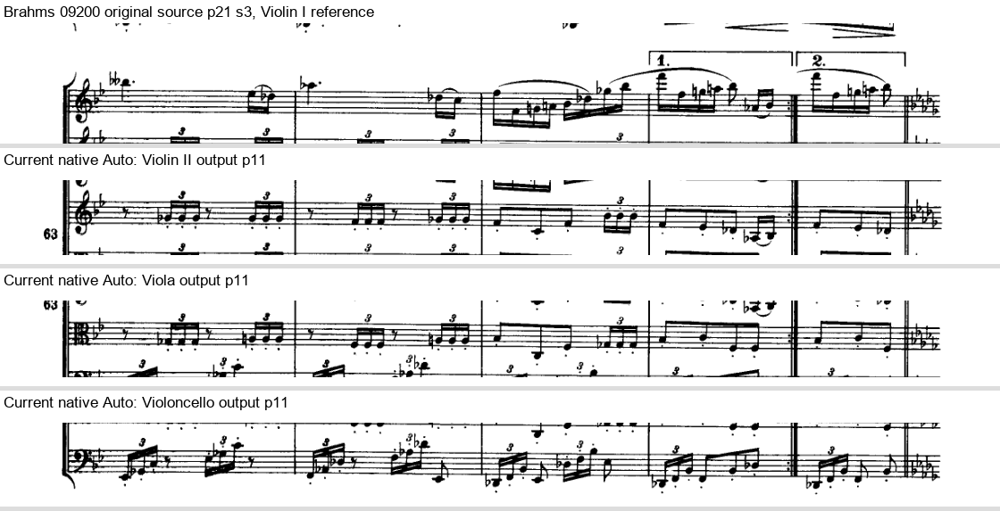
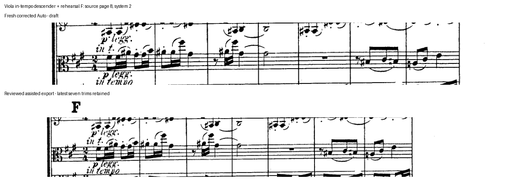

# Brahms Quartet recheck — 10 October 2026

Both test editions of Brahms's String Quartet No. 3, Op. 67 produce all four parts with every expected source system assigned. **Fresh Auto is still a draft:** the review found missing shared directions and substantial neighboring notation. The corrected 39-page example below includes explicitly reviewed assistance; it is not an improvement to the automatic detector.

| Edition | Source scope | Coverage in each part | Current Auto finding |
| --- | --- | --- | --- |
| [IMSLP09200](../sample_scores/medium_skewed/05_brahms_string_quartet_no3_op67_imslp_09200.pdf) | All 25 PDF pages | 120 systems; 480 staves across four parts | No intended note, ledger line, local slur or dynamic loss was identified in the 480 reviewed crop contexts. Some repeat endings and rehearsal letters are missing from lower parts; overlap remains common. |
| [IMSLP93521](../sample_scores/medium_skewed/06_brahms_string_quartet_no3_op67_imslp_93521.pdf) | All 39 PDF pages; cover excluded | 151 systems; 604 staves across four parts | Raw and aligned Auto retain the full source-system sequence. Raw Auto clips the Viola's page 34/system 4 forte hook; alignment retains it. Aligned Auto still clips page 8/system 2's “in tempo” descender and omits rehearsal letters and a fermata from lower parts. |

Page numbers here mean **PDF source pages**, not printed page numbers. The independent source maps, input hashes and actual export hashes distinguish the two editions and every output generation.

## What the recheck covered

Two agents used the current production detection, project, layout and PDF export code, then compared results with the original scores and earlier source-reviewed maps. Instrument lists were initialized with one staff for each of Violin I, Violin II, Viola and Violoncello. This does not establish unattended instrument-name inference.

For IMSLP09200, the fresh Core run used the unrectified original, compact crops, automatic direction copying, and no manual crop overrides. All 480 source crop contexts, 46 historical guard discrepancies and all 53 exported pages were viewed. The crops exactly match the earlier native generation; the current direction copying and pagination differ.

For IMSLP93521, fresh Auto was run on both the raw original and the original with nine saved alignment corrections. The aligned run has 83 output pages. The earlier assisted project was saved/reopened and re-exported through the current native engine. All source identities, crop rectangles, copied directions and changed layouts were checked; the final assisted delivery retains the seven previously reviewed trims.

The [Getting Started screenshots](getting-started.md) are a separate real-app walkthrough using the downloadable Alpha 6 build, the 25-page edition, eight deskew corrections and a printed header. Its 54 exported pages do not inherit the Core run's musical review. [UI verification](../Tests/quality_control/getting-started-ui-2026-10-10/README.md) records that complete import-to-export flow.

## A concrete Auto miss

In IMSLP09200, the first/second endings at source **page 21/system 3**, **page 23/system 4** and **page 24/system 2** are absent from all three lower parts. The image below compares the original Violin I reference with the actual lower-part PDFs at page 21. Zero reported Auto issues did not mean the directions were complete.

The conditional “2da volta rit.” at page 22/system 1 is now present in the lower parts, although Violin II retains a duplicate inside its broad crop. Many rehearsal letters and printed bar-number labels still need review. The [complete 25-page report](../Tests/quality_control/brahms09200-recheck-2026-10-10/README.md) includes the other ending comparisons and coverage evidence. This edition's fresh Auto output was not silently hand-corrected.

## Corrected 39-page example

[Open the complete assisted delivery](../output/pdf/brahms-recheck-2026-10-10/README.md), containing all four PDFs and a zipped editable Partsmith project.

The recommended project retains:

- All **604** source-system crops and the original embedded PDF.
- The **nine** saved alignment corrections and the Viola “in tempo” crop repair.
- The **seven** previously source-reviewed trims that remove complete neighboring staff cores; smaller fragments remain.
- The previous **42** source-marking copies, plus **72** reviewed additions: 23 rehearsal locations and one fermata, each copied to the three lower parts.

The additions total **114** copied regions. Export has **20 / 20 / 19 / 19 pages** for Violin I / Violin II / Viola / Violoncello. The current engine's literal spacing and added markings can change pagination compared with earlier releases.

Independent review caught a varying-page-size assumption in the first added-cue export. It was corrected before delivery. The final cue rectangles match the frozen source coordinates, and the actual exported destinations were checked for complete glyphs, correct instrument/system placement and collisions. The old source-crop repair and reviewed trims remain explicit assistance, rather than being attributed to Auto.

The comparison below shows the fresh aligned Auto crop above and the assisted Viola output below, with the complete “in tempo” text and copied rehearsal F. Some neighboring ink remains to protect intended notation.

This is a reviewed draft for further cleanup and test driving. Neighboring fragments and difficult page turns remain; performance turns have not been certified. No production detection algorithm or app binary was changed by this recheck. The current download remains [Alpha 6](https://github.com/wmppaul/partsmith/releases/tag/v0.1.0-alpha.6).

## How to use these findings

Use the [illustrated Getting Started guide](getting-started.md) to generate parts. Then compare each part with the score before trimming or compressing rests. The [Advanced workflows guide](advanced-workflows.md) explains crop expansion, Preview cleanup, changing instrumentation, layout and rest controls.

Native **Expand Crop** can retain a nearby direction, and **Editorial Label** can add accurately transcribed text at a system's start. The released app has no general drawing tool for arbitrary new source copies or for placing an interior ending bracket. The [extraction skill](../skills/score-part-extraction/SKILL.md) can assist with those source-coordinate corrections. That distinction matters for the missing endings above.

Detailed reproducible evidence: [39-page recheck](../Tests/quality_control/brahms-recheck-2026-10-10/README.md), [25-page recheck and independent cross-review](../Tests/quality_control/brahms09200-recheck-2026-10-10/README.md), and [quality-control index](../Tests/quality_control/README.md).
