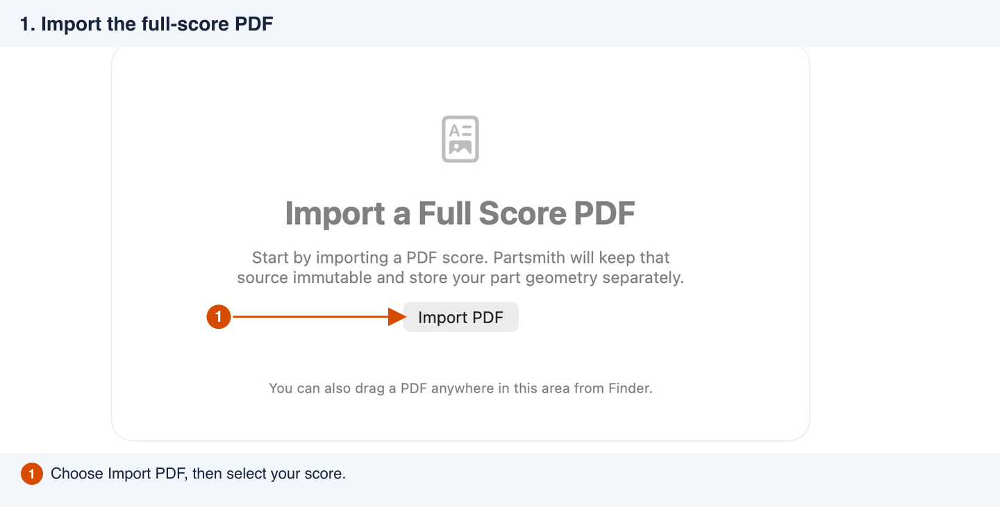
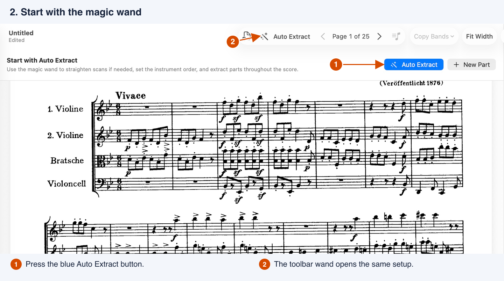
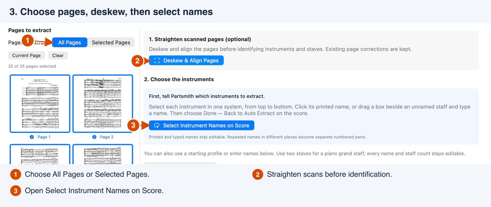
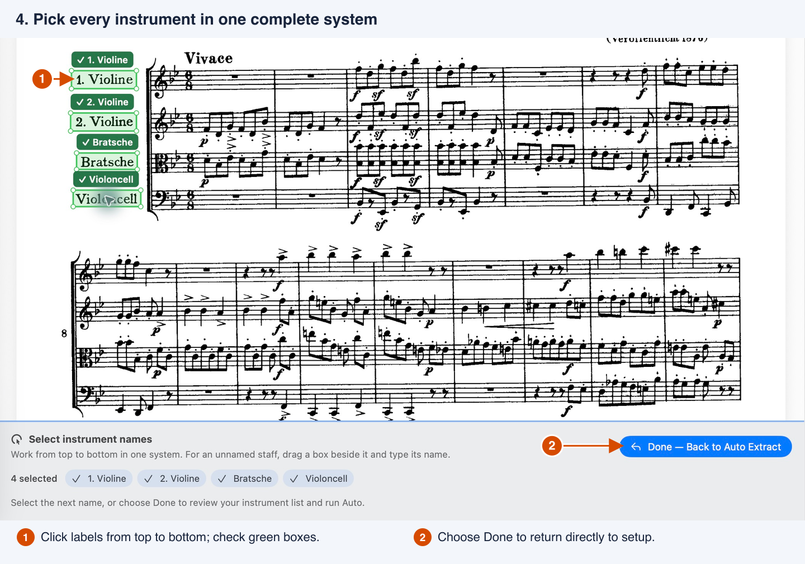
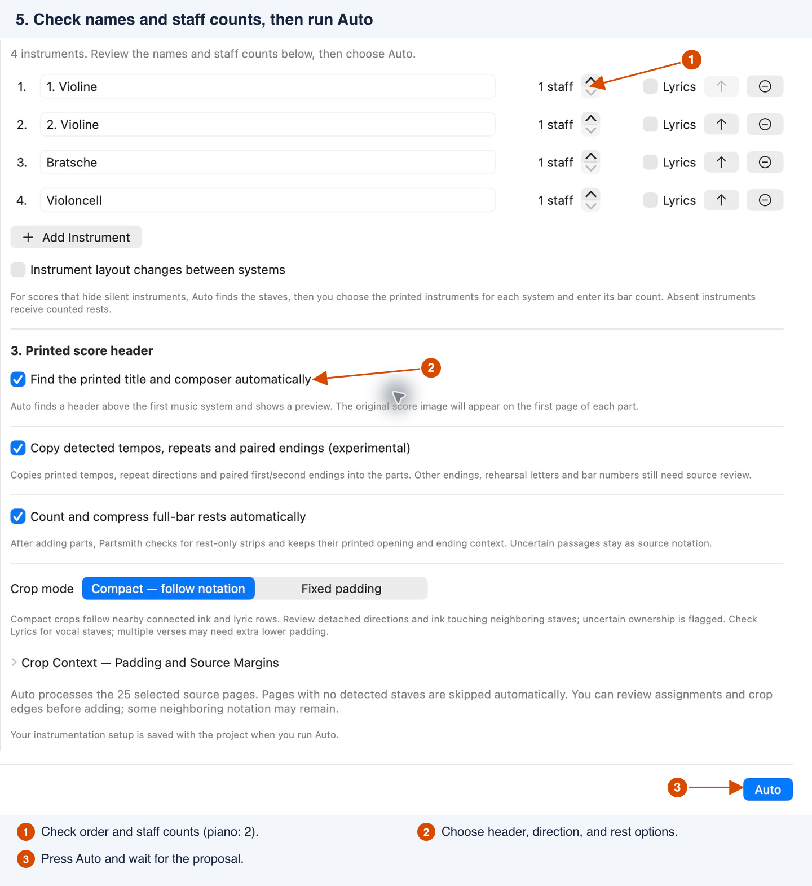
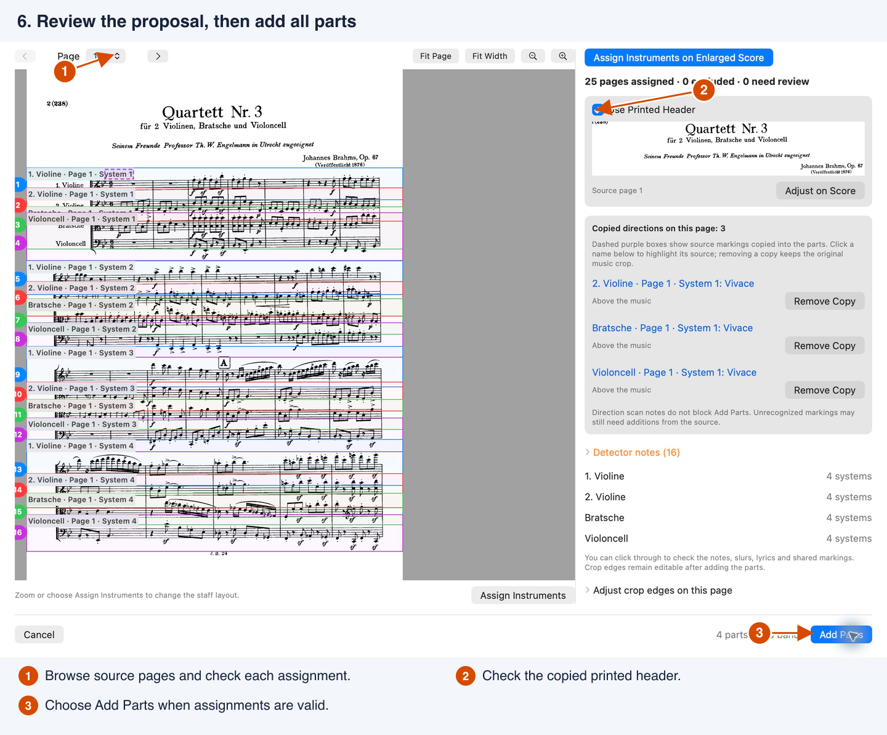
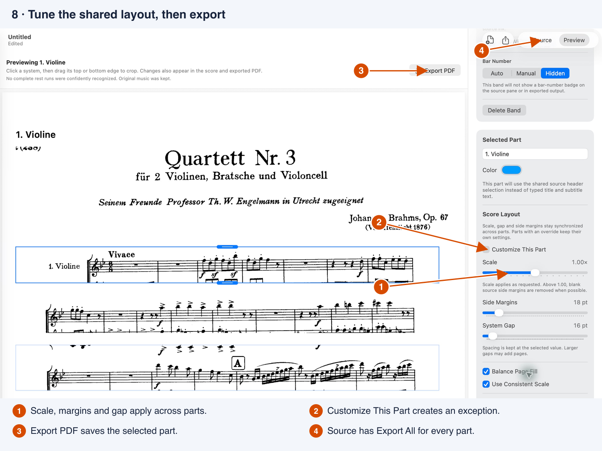

# Getting Started with Partsmith

Turn a full-score PDF into editable parts, using **Auto Extract** on your Mac. This guide follows the downloadable **Alpha 6** app with a scanned Brahms string quartet. The numbered callouts show the controls to press; click a picture to view it at full size.

**[Download Partsmith for macOS](https://github.com/wmppaul/partsmith/releases/tag/v0.1.0-alpha.6)** · [Advanced workflows](advanced-workflows.md) · [Known limitations](../KNOWN_LIMITATIONS.md)

Requires macOS 14 or later, on Apple Silicon or Intel. Unzip and open `Partsmith.app`. If macOS blocks this unnotarized alpha, try opening it first, then use **System Settings → Privacy & Security → Open Anyway**. Processing runs locally; you do not need an internet connection after downloading.

## 1. Open your full score

Choose **File → New** if needed, then **Import PDF** and select the full-score PDF. You can also drag a PDF into the center pane. Use **File → Open** for an existing `.partsmithproject`.

## 2. Press the magic wand

Choose the blue **Auto Extract** button above the score, or the magic wand in the toolbar. The Auto window is movable and resizable.

## 3. Choose pages, then straighten scans

Keep **All Pages** for a document containing only music. To exclude covers or contents, choose **Selected Pages** and click the thumbnails or enter a range such as `2-8, 12`. Blue borders and checkmarks identify included pages. The page numbers refer to PDF pages, which may differ from the printed numbers.

For a tilted scan, press **Deskew & Align Pages** now, before picking names or detecting staves. Wait for it to finish. Deskew uses the same page selection as Auto and keeps existing page corrections. A clean digital score can usually skip this step.

Next, choose **Select Instrument Names on Score**. With Selected Pages, Partsmith takes you to the first included page.

## 4. Identify the instruments once

In one complete system, click the printed instrument names **from top to bottom**. Green boxes show what Partsmith read. Include numbers such as `1.` and `2.` so the two violins are easy to distinguish.

If recognition misses a word or number, drag a box around the complete label, or adjust its green corner handles. If no name is printed, drag a box in the blank area beside that staff, type a name in the bar below the score, set its staff count, and press **Add Instrument** or Return. Separate selections create separate parts even when the printed names match.

Choose **Done — Back to Auto Extract** in the bottom bar when every instrument is included. It brings setup forward automatically.

You can instead use **Use a Starting Profile**, or type entries with **Add Instrument** in setup. These name selections build the instrument list; Auto finds the actual staff crops next.

## 5. Check the list and run Auto

Verify names, top-to-bottom order, and staff counts. For this quartet there are four entries with **1 staff** each. A piano grand staff needs **2 staves** in one entry. Enable **Lyrics** for vocal parts.

Leave **Compact — follow notation** as the starting crop mode. The optional printed-header setting copies the score's title and composer. Experimental shared-direction detection and full-bar rest compression can help, but both need checking against the source.

For a score that omits silent instruments from some systems, enable **Instrument layout changes between systems** and follow [Assign Instruments](advanced-workflows.md#scores-that-hide-silent-instruments). Leave it off for this fixed quartet layout.

Press **Auto** at the bottom right. Analysis can take time on a large score; wait for the review to appear.

## 6. Check the proposal and add the parts

Browse the source pages in the review and check that each colored crop belongs to the named instrument and includes its intended notation. Check the suggested printed header too. Use **Adjust crop edges on this page** for crops, or **Assign Instruments** for staff assignments; an enlarged score view is available for harder layouts.

Choose **Add Parts** when the assignments are valid. You do not need to check an “I reviewed” box. Pages with no detected staves are skipped automatically; **View Skipped Pages** is optional. If a skipped page contains music, restore and correct it. Unassigned staves, conflicting populated part names, or missing bar counts for absent instruments still need resolving.

## 7. Refine each part in Preview

Select an instrument in the sidebar and switch to **Preview**. Click a system to show its blue top and bottom handles. Drag an edge to remove extra neighboring staff fragments; release to apply, or Escape to cancel. **Undo** restores the previous crop. Changes also appear in Source, the saved project, and exported PDFs.

Check the ink just outside the crop before trimming: preserve notes, ledger lines, slurs, dynamics, lyrics and directions. If a needed mark is missing, select the system and use **Expand Crop** in the Inspector. Some physically overlapping notation may need to remain.

## 8. Set layout, save, and export

In **Score Layout**, adjust **Scale**, **Side Margins**, and **System Gap**. These settings synchronize across parts; **Customize This Part** makes an exception. New projects start with 18 pt side margins. Scale applies as requested, so check paper edges if a width warning appears. Larger gaps add space and may add pages.

Save with **File → Save** or Command-S. Keep the `.partsmithproject` for later editing; it embeds the source PDF.

Use **Export PDF** in Preview for the selected part. For every instrument, switch to **Source** and choose **Export All**, or use **File → Export All…**. Choose a destination; Partsmith creates an export folder with one PDF per part. Saving a project and exporting PDFs are separate actions.

Open the actual exported PDFs before sharing. Compare all parts with the score, including entrances after rests, repeat endings, rehearsal letters, tempo or meter changes, and page turns. Auto is a starting point for reviewed parts; a clean-looking page does not establish that all the music is present.

## When the score needs more help

The [Advanced workflows guide](advanced-workflows.md) covers unnamed or repeated instruments, changing instrumentation and inserted rests, overlapping crops, shared directions, layout overrides, rest compression, and troubleshooting.

The [Brahms recheck](brahms-quartet-review.md) records what current Auto preserved and what needed assisted correction. The screenshots demonstrate the workflow rather than certify an untouched Auto output for performance.
